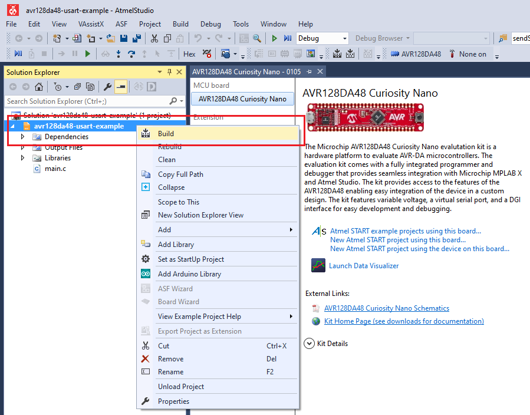

# Send Hello World! over USART

This repository provides an Atmel Studio solution with a bare metal code example for a basic USART communication.
This example demonstrates the basic functionality of the USART peripheral. The message "Hello world!" is sent through TXd (PC0) pin every one second and can be viewed using a terminal on a PC.

## Related Documentation
More details and code examples on the AVR128DA48 can be found at the following links:
- [AVR128DA48 Product Page](https://www.microchip.com/wwwproducts/en/AVR128DA28)
- [AVR128DA48 Code Examples on GitHub](https://github.com/microchip-pic-avr-examples?q=avr128da48)
- [AVR128DA48 Project Examples in START](https://start.atmel.com/#examples/AVR128DA48CuriosityNano)

## Software Used
- Microchip Studio 7.0.2397 or newer [(Microchip Studio for AVR® and SAM Devices)](https://www.microchip.com/en-us/development-tools-tools-and-software/microchip-studio-for-avr-and-sam-devices)
- AVR-Dx 1.0.18 or newer Device Pack

## Hardware Used
- AVR128DA48 Curiosity Nano [(DM164151)](https://www.microchip.com/Developmenttools/ProductDetails/DM164151)

## Setup
The AVR128DA48 Curiosity Nano Development Board is used as test platform
 

The following configurations must be made for this project:

USART1:
  - Baud rate 9600
  - Transmitter enabled
  - Data format to 8-bit

|Pin           | Configuration      |
| :----------: | :----------------: |
|PC0 (TXd)     | Digital Output     |
|PC1 (RXd)     | Digital Input      |

## Operation

1. Open the *avr128da48-usart-example.atsln* solution in Atmel Studio

2. Build the solution: right click on *avr128da48-usart-example* solution and select Build
 

3. Select the AVR128DA48 Curiosity Nano on-board debugger in the *Tool* section of the project settings:
- Right click on the project and click *Properties*;
- Click *Tool* tab on the left panel, select the corresponding debugger and save the configuration (Ctrl + S)
 

4. Program the project to the board: select *avr128da48-usart-example* project and click *Start Without Debugging*:
 

Demo:
 

## Summary
This example represents a basic functionality of the USART peripheral. The message "Hello world!" is sent through TXd (PC0) pin every one second and can be viewed using a terminal on a PC.
